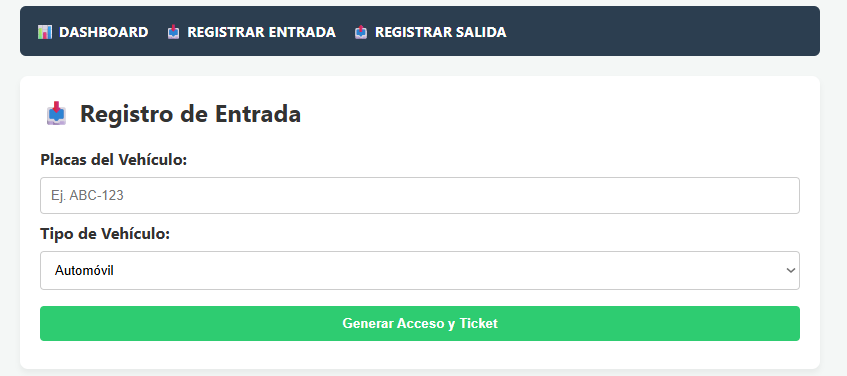
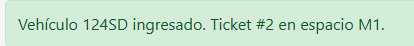
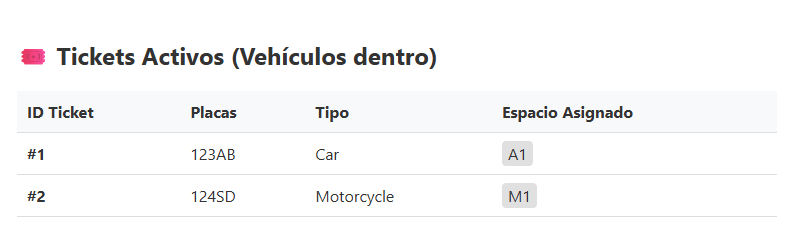
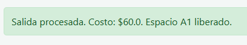
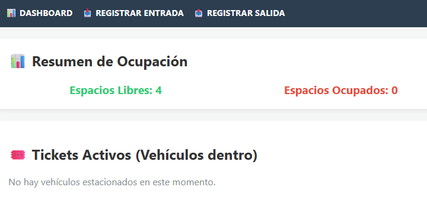

# Práctica 2: Sistema de Gestión de Estacionamiento
### con Programación Orientada a Objetos y Flask

---

| | |
|---|---|
| **Nombre** | Jareth Izhar Aparicio Lopez |
| **Matrícula** | 376619 |
| **Materia** | Paradigmas de la Programación |
| **Práctica** | 2 — POO + Flask |

---

## 1. Introducción

El presente proyecto consiste en el desarrollo de un sistema de gestión para un estacionamiento. A diferencia de un enfoque estructurado tradicional, esta práctica se abordó utilizando el paradigma de **Programación Orientada a Objetos (POO)** en Python, aprovechando sus cuatro pilares fundamentales: encapsulamiento, herencia, polimorfismo y abstracción.

Además de la lógica interna, el sistema fue integrado con **Flask** para exponer sus funcionalidades a través de un servidor web local, permitiendo gestionar entradas, salidas y el cálculo de tarifas mediante peticiones HTTP desde un navegador.

---

## 2. Arquitectura del Sistema

El proyecto se organizó en módulos independientes bajo la carpeta `models/`, separando las responsabilidades de cada clase:

| Archivo | Clase | Responsabilidad |
|---|---|---|
| `vehicle.py` | `Vehicle / Car / Motorcycle` | Modela los vehículos con herencia |
| `spot.py` | `ParkingSpot` | Representa y gestiona cada cajón |
| `ticket.py` | `Ticket` | Registra la estancia de un vehículo |
| `rates.py` | `HourlyRatePolicy` | Calcula el costo por hora |
| `parking_lot.py` | `ParkingLot` | Orquesta todo el estacionamiento |
| `app.py` | `Flask App` | Expone la API REST y la interfaz web |

---

## 3. Conceptos de POO Aplicados

### 3.1 Clase

Una clase es una plantilla que define atributos y comportamientos. En el proyecto se definió la clase base `Vehicle` con el atributo `placas`, y la clase `ParkingLot` para gestionar los espacios.

### 3.2 Objeto

Un objeto es una instancia concreta de una clase. Al registrar la entrada de un vehículo se crea una instancia real:

```python
mi_auto = Car(placas="BCA-1234")
```

### 3.3 Herencia

Las clases `Car` y `Motorcycle` heredan de la clase padre `Vehicle`, compartiendo el atributo `placas` pero especializando el atributo `tipo`:

```python
@dataclass
class Vehicle:
    placas: str
    tipo: str

@dataclass
class Car(Vehicle):
    tipo: str = "Car"

@dataclass
class Motorcycle(Vehicle):
    tipo: str = "Motorcycle"
```

### 3.4 Encapsulamiento

Los atributos internos del estacionamiento se protegen con prefijo de guion bajo (`_spots`, `_tickets_activos`). Su modificación solo ocurre mediante los métodos `registrar_entrada()` y `registrar_salida()`, garantizando la integridad de los datos.

### 3.5 Abstracción

Desde Flask, se invoca `estacionamiento.registrar_entrada(vehiculo)` sin conocer los cálculos internos. El sistema localiza el cajón disponible, genera el ticket y actualiza el estado en una sola llamada.

### 3.6 Polimorfismo

La política de tarifas se aplica polimórficamente: `HourlyRatePolicy` cobra **$20/h** para autos y **$10/h** para motos mediante el mismo método `calculate(hours, vehicle)`, adaptando el resultado según el tipo.

```python
class HourlyRatePolicy:
    def calculate(self, hours: float, vehicle: Vehicle) -> float:
        tarifa_base = 20.0 if vehicle.tipo == "Car" else 10.0
        return tarifa_base * hours
```

---

## 4. Integración con Flask

Se crearon tres endpoints REST que interactúan con la capa de objetos del sistema:

| Ruta | Método | Descripción |
|---|---|---|
| `/api/entrada` | `POST` | Registra la entrada de un vehículo, asigna cajón y genera ticket |
| `/api/salida` | `POST` | Registra la salida, calcula costo y libera el cajón |
| `/api/ocupacion` | `GET` | Retorna el estado actual: cajones libres, ocupados y tickets activos |

Fragmento del servidor Flask (`app.py`):

```python
from flask import Flask, jsonify, request, render_template
from models.vehicle import Car, Motorcycle
from models.parking_lot import ParkingLot

app = Flask(__name__)
estacionamiento = ParkingLot(spots, policy)

@app.route('/api/entrada', methods=['POST'])
def entrada():
    data = request.json
    vehiculo = Car(placas=data['placas']) if data['tipo'] == 'Car' \
               else Motorcycle(placas=data['placas'])
    ticket = estacionamiento.registrar_entrada(vehiculo)
    return jsonify({'ticket_id': ticket.id_ticket, 'spot': ticket.spot.id_spot})
```

---

## 5. Instrucciones de Ejecución

1. Instalar la dependencia: `pip install flask`
2. Colocar los archivos en la estructura:
   ```
   parking/
   ├── app.py
   ├── templates/
   │   └── index.html
   └── models/
       ├── __init__.py
       ├── vehicle.py
       ├── spot.py
       ├── ticket.py
       ├── rates.py
       └── parking_lot.py
   ```
3. Ejecutar desde la carpeta raíz: `python app.py`
4. Abrir en el navegador: `http://127.0.0.1:5000`

---

## 6. Capturas de Pantalla — Registro de Ingreso

### Figura 6.1 — Formulario de registro de entrada (vista inicial)




---

### Figura 6.2 — Registro exitoso de un automóvil


---

### Figura 6.3 — Registro exitoso de una motocicleta




---

### Figura 6.4 — Panel de vehículos activos actualizado




---

## 7. Capturas de Pantalla — Registro de Salida

### Figura 7.1 — Formulario de salida con datos ingresados


---

### Figura 7.2 — Resultado del cálculo de tarifa (Auto)




---

### Figura 7.3 — Resultado del cálculo de tarifa (Motocicleta)


---

### Figura 7.4 — Estadísticas actualizadas tras la salida




---

## 8. Conclusión

El desarrollo de este sistema permitió consolidar el uso práctico de los cuatro pilares de la Programación Orientada a Objetos. La separación del código en clases con responsabilidades específicas facilitó la legibilidad, el mantenimiento y la extensibilidad del proyecto.

La integración con Flask demostró cómo una capa de objetos bien diseñada puede conectarse con tecnologías web de manera limpia, exponiendo únicamente la interfaz necesaria a través de endpoints REST. Esto refuerza el concepto de abstracción: los consumidores del API no necesitan conocer la lógica interna para interactuar con el estacionamiento.

Como trabajo futuro, el sistema podría extenderse con persistencia en base de datos, autenticación, y el uso del patrón de diseño Observer para notificaciones en tiempo real.
