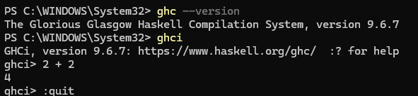
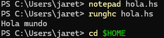
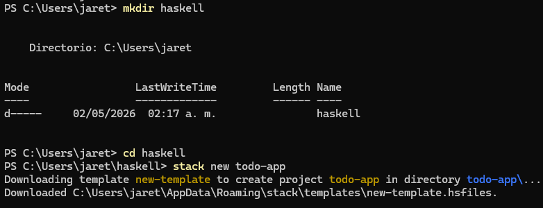
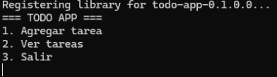
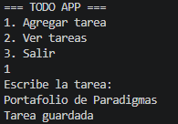
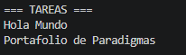

---

| | |
|---|---|
| **Nombre** | Jareth Izhar Aparicio López |
| **Matrícula** | 376619 |
| **Materia** | Paradigmas de la Programación (PP) |
| **Maestro** | Jose Carlos Gallegos Mariscal |
| **Práctica** | 3 — Haskell |
| **Fecha** | 5/2/2026 |

---

## 1. Introducción

En esta práctica se realizó la instalación del entorno de desarrollo del lenguaje Haskell utilizando la herramienta **GHCup**, la cual permite gestionar de manera sencilla el compilador y las herramientas asociadas al ecosistema funcional.

Además, se desarrolló una aplicación tipo **TODO** en consola con el objetivo de comprender el funcionamiento básico del lenguaje, el manejo de entrada/salida, y la estructura de un proyecto en Haskell usando Stack y Cabal.

---

## 2. Primera Sesión — Instalación del Entorno

### 2.1 Proceso de instalación con GHCup

Se accedió a la [página oficial de descargas de Haskell](https://www.haskell.org/downloads/) y se siguió el enlace a **GHCup**, que centraliza la gestión de todas las herramientas del ecosistema. El comando de instalación se ejecutó en una ventana de **PowerShell sin privilegios de administrador**:

```powershell
Set-ExecutionPolicy Bypass -Scope Process -Force
irm https://www.haskell.org/ghcup/sh/bootstrap-haskell.ps1 | iex
```

### 2.2 Componentes instalados

| Herramienta | Descripción |
|---|---|
| **GHCup** | Gestiona la instalación de todo el entorno de desarrollo |
| **GHC** | Glasgow Haskell Compiler — compilador principal de Haskell |
| **GHCi / Hugs** | Intérprete interactivo de Haskell para pruebas rápidas |
| **HLS** | Haskell Language Server — provee librerías estándar y soporte para editores |
| **Stack** | Manejador de paquetes y proyectos, similar a `pip` en Python |
| **Cabal** | Build tool: usa Stack para dependencias y GHC para compilar en un solo comando |

> Los archivos de código fuente de Haskell usan la extensión **`.hs`**

### 2.3 Verificación del entorno

Una vez instalado, se ejecutaron los siguientes comandos para confirmar el correcto funcionamiento:

```powershell
ghc --version
# The Glorious Glasgow Haskell Compilation System, version 9.6.7

ghci
# GHCi, version 9.6.7: https://www.haskell.org/ghc/  :? for help
ghci> 2 + 2
# 4
ghci> :quit
```

También se creó y ejecutó un programa básico "Hola mundo":

```powershell
notepad hola.hs
runghc hola.hs
# Hola mundo
```

Código de `hola.hs`:

```haskell
main :: IO ()
main = putStrLn "Hola mundo"
```

---

## 3. Segunda Sesión — Aplicación TODO en Haskell

### 3.1 Creación del proyecto con Stack

Se creó el proyecto usando Stack desde la carpeta de trabajo:

```powershell
mkdir haskell
cd haskell
stack new todo-app
cd todo-app
stack run
```

Stack descargó la plantilla `new-template` y configuró automáticamente la estructura del proyecto.

### 3.2 Código principal

La aplicación se implementó en el archivo `app/Main.hs`:

```haskell
module Main where

import System.IO

main :: IO ()
main = do
    putStrLn "=== TODO APP ==="
    menu

menu :: IO ()
menu = do
    putStrLn "1. Agregar tarea"
    putStrLn "2. Ver tareas"
    putStrLn "3. Salir"
    opcion <- getLine
    case opcion of
        "1" -> agregar
        "2" -> ver
        "3" -> putStrLn "Adios!"
        _   -> putStrLn "Opcion invalida" >> menu

agregar :: IO ()
agregar = do
    putStrLn "Escribe la tarea:"
    tarea <- getLine
    appendFile "tareas.txt" (tarea ++ "\n")
    putStrLn "Tarea guardada"
    menu

ver :: IO ()
ver = do
    contenido <- readFile "tareas.txt"
    putStrLn "=== TAREAS ==="
    putStrLn contenido
    menu
```

### 3.3 Funcionamiento de la aplicación

La aplicación presenta un menú interactivo de tres opciones. El flujo se controla mediante una expresión `case` que despacha a la función correspondiente según la entrada del usuario:

- **Agregar tarea** — Solicita texto al usuario y lo escribe al final de `tareas.txt` usando `appendFile`
- **Ver tareas** — Lee el contenido completo de `tareas.txt` con `readFile` y lo imprime en pantalla
- **Salir** — Termina la ejecución del programa

### 3.4 Características técnicas del lenguaje aplicadas

| Característica | Uso en la aplicación |
|---|---|
| `IO ()` | Tipo de todas las funciones que realizan entrada/salida |
| `do` notation | Secuencia de acciones de I/O de forma imperativa |
| `getLine` | Lee una línea de texto desde la entrada estándar |
| `appendFile` | Agrega texto al final de un archivo sin sobrescribirlo |
| `readFile` | Lee el contenido completo de un archivo como `String` |
| `case` expression | Control de flujo según el valor de la opción ingresada |
| `>>` | Encadena dos acciones IO descartando el resultado de la primera |

---

## 4. Relación con la Guía Oficial

La implementación sigue el enfoque presentado en el blog oficial de Haskell ([How to use Haskell to build a todo app with Stack](https://www.haskell.org/)):

- Uso de proyectos gestionados con **Stack**
- Separación de la lógica en funciones independientes con tipos explícitos
- Manejo de archivos para **persistencia de datos** entre ejecuciones
- Aplicación práctica del **paradigma funcional**: funciones puras complementadas con acciones IO

---

## 5. Capturas de Pantalla

### Figura 5.1 — Verificación de instalación de GHC y GHCi

>  *Salida de `ghc --version` y sesión de `ghci` con `2 + 2`*



---

### Figura 5.2 — Ejecución del programa "Hola mundo"

>  *Captura: `runghc hola.hs` mostrando "Hola mundo" en terminal*



---

### Figura 5.3 — Creación del proyecto con Stack

>  *Captura: `stack new todo-app` descargando la plantilla*



---

### Figura 5.4 — Menú principal de la aplicación TODO

>  *Captura: `stack run` mostrando el menú interactivo*



---

### Figura 5.5 — Agregar una tarea

>  *Captura: ingreso de una tarea y confirmación "Tarea guardada"*



---

### Figura 5.6 — Ver tareas almacenadas

>  *Captura: opción 2 mostrando las tareas guardadas en `tareas.txt`*



---

## 6. Conclusión

El desarrollo de esta práctica permitió:

- Comprender el proceso de instalación del entorno de Haskell mediante **GHCup** y sus componentes principales
- Familiarizarse con herramientas modernas del ecosistema como **Stack** y **Cabal**
- Aplicar conceptos fundamentales del paradigma funcional: tipos, funciones puras y acciones IO
- Implementar una aplicación funcional de consola con manejo de archivos para persistencia

Haskell, aunque distinto a los lenguajes imperativos tradicionales, ofrece una forma estructurada y poderosa de desarrollar software. La notación `do` permite escribir código con I/O de manera legible, mientras el sistema de tipos garantiza mayor seguridad en tiempo de compilación.
